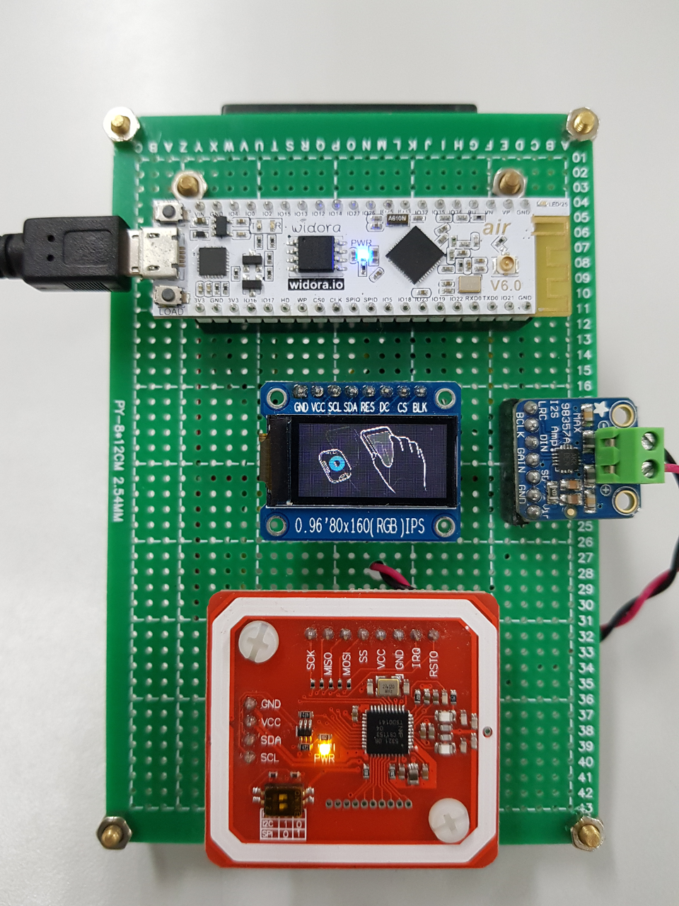

NFC Attendance System
=====================

NFC Attendance System based on ESP32 chip.

## Main Features

* NFC-Token Exchange (via PN532)
* GUI Output (GIF Animations)
* Audio Prompt (I2S Output)
* Wifi SmartConfig (with External Key)
* OTA Firmware Update (via HTTP/HTTPS)

## Preparing

### Obtain the Source

```
git clone --recursive https://github.com/redchenjs/nfc_attendance_system_esp32.git
```

### Update an existing repository

```
git pull
git submodule update --init --recursive
```

### Setup the Tools

```
./esp-idf/install.sh
```

## Building

### Setup the environment variables

```
export IDF_PATH=$PWD/esp-idf
source ./esp-idf/export.sh
```

### Configure

```
idf.py menuconfig
```

* All project configurations are under the `NFC Attendance System` menu.

### Flash & Monitor

```
idf.py flash monitor
```

## Board



## Videos Links

* [智慧校园NFC考勤系统简介](https://www.bilibili.com/video/av64088862)
